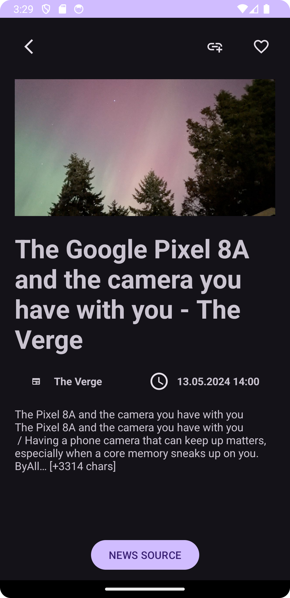
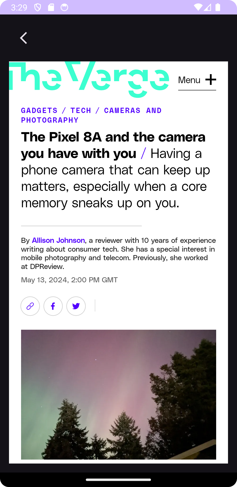
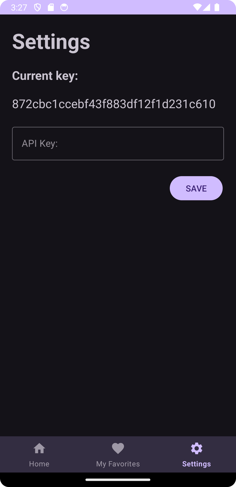
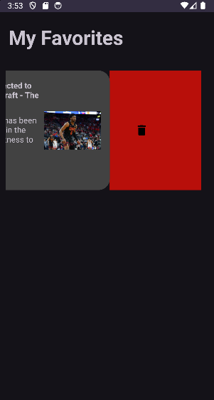

# News
Welcome to News, an innovative way to stay updated! It provides an innovative interface to read the latest news from the world, search specific news and add them to favorites. You'll stay informed and connected with the world.

## Features

1. Open source and completely free
2. Reading the latest news automatically
3. Exploring and adding to favorites to read easily
4. Going to source of the news
5. Works with News API Key, you gotta get your own!
6. Swipe to left to delete the news from favorites section!

## Used Technologies

1. Android Studio
2. Room Library to access SQLite database.
3. Shared Preferences to set the API Key.
4. Retrofit libraries to access the API and retrieve it.
5. Glide library to getting images.
6. Made with MVVM and SOLID architectures

## Screenshot

<table>
  <tr>
    <td> </td>
   </tr> 
</table>

<table>
  <tr>
    <td> </td>
   </tr> 
</table>

<table>
  <tr>
    <td> </td>
   </tr> 
</table>

<table>
  <tr>
    <td> </td>
   </tr> 
</table>

<table>
  <tr>
    <td> </td>
   </tr> 
</table>

It's in early stage, it'll have new features.